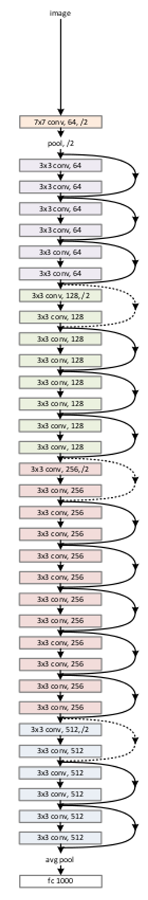

 

### Check out the app live on [Streamlit Share](https://share.streamlit.io/pranjal198/x-men-classifier/main/app.py)

 
I recently binged all the X-men movies and instantly became a fan, So after exploring CNNs and learning about transfer learning for making image classifiers, I had the idea of making this fun project to classify various X-men.
 
 

# Dataset

I couldn't find a readymade dataset on the various platforms present, So I made my own dataset of about 2000 images by scraping images from google searches using the [Selenium](https://www.selenium.dev/) utility.
 
 

# About the model
I used the [Tensorflow framework](https://www.tensorflow.org/) for data augmentaion and building the model.

The base model is [ResNet50](https://keras.io/api/applications/resnet/) and a [Global Average Pooling](https://www.tensorflow.org/api_docs/python/tf/keras/layers/GlobalAveragePooling2D) layer has been added along with a Prediction layer to classify the image into one of the classes. Various callback techniques like [Early Stopping](https://www.tensorflow.org/api_docs/python/tf/keras/callbacks/EarlyStopping), [Model Checkpoint](https://keras.io/api/callbacks/model_checkpoint/) and [Adaptive Learning Rates](https://towardsdatascience.com/learning-rate-schedules-and-adaptive-learning-rate-methods-for-deep-learning-2c8f433990d1) have been used for improving upon the accuracy of the model. 

An overview of the ResNet50 model:
 

 

# Accuracy

The model achieved an accuracy of 93.67% on the training dataset, 91% on the validation dataset and 89% on the test dataset which is optimum considering that the dataset was self-accumulated.
 

# Application

For making the use of my model easy and convenient I made a simple app using the [Streamlit Framework](https://streamlit.io/) and also deployed it using [Streamlit Share](https://share.streamlit.io/) for sharing it with my friends.

 
# Scope
1) Expanding the dataset to increase the number of characters.
2) Improving the UI of the application.

 
<strong><em>Your suggestions and criticisms are welcome, Don't forget to share this with your friends and star the repository</em></strong>.

 
 

